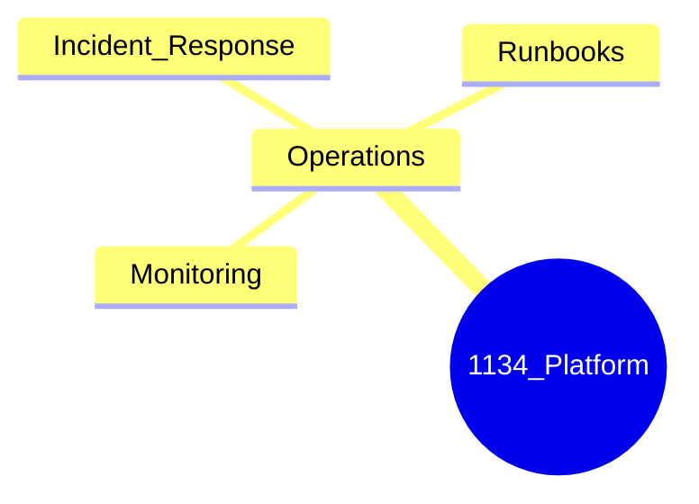

# ops

[View SVG](./PlatformMindMap_ops.svg)

```mermaid
mindmap
%% Global (included in all views)
  root((1134_Platform))


    Operations
      Monitoring
      Incident_Response
      Runbooks
```
