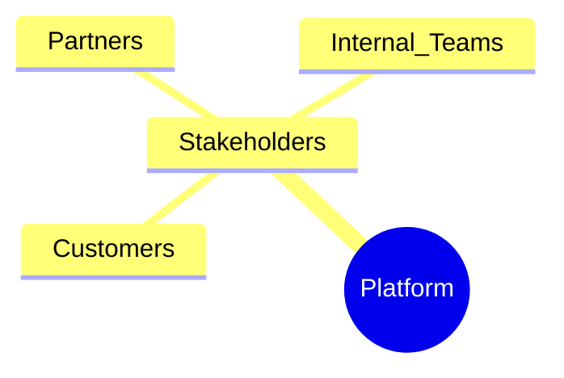

# stakeholders

[View SVG](./PlatformMindMap_stakeholders.svg)

```mermaid
mindmap
%% Global (included in all views)
  root((Platform))


    Stakeholders
      Customers
      Partners
      Internal_Teams
```
