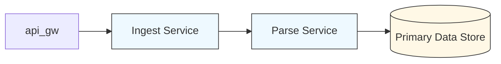

# dataflow

[View SVG](./TechnicalArchitecture_dataflow.svg)

```mermaid
flowchart LR
%% Global config (included in all views)
%%{init: {"theme":"default"}}%%


%% Connections (tag edges so they carve cleanly)


%% Styles (global)
classDef actor fill:#fff,stroke:#333,stroke-width:1px;
classDef component fill:#f7f7ff,stroke:#333,stroke-width:1px;
classDef service fill:#eef9ff,stroke:#333,stroke-width:1px;
classDef data fill:#fff8e6,stroke:#333,stroke-width:1px;
classDef ops fill:#f0fff4,stroke:#333,stroke-width:1px;
classDef security fill:#fff0f0,stroke:#333,stroke-width:1px;
ingest["Ingest Service"]:::service
parse["Parse Service"]:::service
store[("Primary Data Store")]:::data
api_gw --> ingest
ingest --> parse
parse --> store
```
